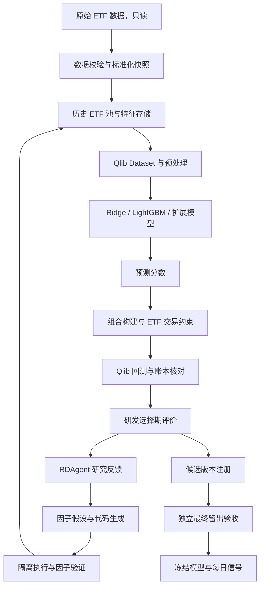

# 01 系统设计

状态：工程规格，实施中；现有功能及尚未通过的门禁见 [实现进度](05-implementation-status.md)。

## 1. 目标与范围

建立一套可复现的 ETF 横截面机器学习研究系统：从当时可知的信息构造特征，预测下一执行时点之后的收益，生成可执行的组合，再以统一验证协议判断新增因子和模型是否有效。

第一版包括历史数据治理、LightGBM 与 Ridge 基线、RDAgent 自动因子实验、日频组合回测、实验注册与手动触发的每日信号。第一版不包含券商下单、分钟级交易、申赎套利、杠杆与融券；这些需要独立的行情和执行设计。

用户已确认研究范围为 A 股场内现有正常运营的 ETF，第一版按跟踪境内 A 股的股票 ETF 理解。当前池保存查询时点和状态依据，历史池按当时已知的上市、分类和运营状态重建。主基准为沪深300指数，初始资金 500,000 元，单边滑点 0.03%；佣金最新确认为0.03%（0.0003）；K=0.05为当前可买候选前5%，流动性20%为过去20日均成交额参与上限，风险为最大回撤12%；LLM费用不设上限，暂按比例佣金、不另加最低费用；常规交易约束沿用首轮配置。分类依据应联合跟踪资产、投资范围和交易规则，不能仅凭代码前缀或当前 `etf_type` 字段判断。跨境、债券、黄金 ETF 后续启用时需完成对应日历、信息发布时间与交易规则校验。

## 2. 系统结构



最终留出验收的数据和产物不进入研发反馈链。快照应分为研发可见视图和最终验收视图，不能仅靠提示词隐藏留出区间。

## 3. 模块责任与接口

以下是工程接口规格，具体类型定义在实现阶段落地。接口输入都使用经过验证、带版本标识的对象。

| 模块 | 职责 | 主要接口 | 输出 |
| --- | --- | --- | --- |
| `data` | 校验日历、价格、单位和时点，构建快照 | `build_snapshot(source, spec)` | `DataSnapshot` |
| `universe` | 在给定决策时点生成可投资池 | `resolve(as_of, snapshot, policy)` | 历史成员与 eligibility 原因 |
| `features` | 计算基线/候选特征和质量门禁 | `materialize(feature_set, snapshot, cutoff)` | `FeatureArtifact` |
| `datasets` | 特征标签对齐、预处理、时间切分 | `build(feature_set, label_spec, split_spec)` | Qlib Dataset 与 manifest |
| `models` | 配置模型、训练、预测和持久化 | `fit(dataset, model_spec)`；`predict(bundle, dataset)` | `ModelBundle`、预测序列 |
| `portfolio` | 分数转权重，处理既有持仓与限制 | `construct(scores, positions, constraints)` | 目标权重与订单意图 |
| `backtest` | 调用 Qlib 回测并核对费用和净值 | `evaluate(predictions, policy, snapshot)` | 交易、持仓、收益与指标 |
| `research` | 组织对照实验与决策 | `compare(baseline_id, candidate_id, protocol)` | `EvaluationResult` |
| `adapters/rdagent` | 将 Agent 任务接到上述模块 | `develop(experiment)` | RDAgent 兼容结果与结构化反馈 |
| `runtime` | 工作区、进程/容器、超时与产物收集 | `run(argv, workspace, env, limits)` | `ExecutionResult` |
| `registry` | 管理因子、模型与部署版本 | `register(artifact, lineage)` | 不可变 ID 和状态 |

统一预测契约为带 `(datetime, instrument)` 唯一索引的分数序列，附带 `model_id`、`feature_set_id`、`as_of`、`horizon`、`score_type` 和配置哈希。模型分数通常用于排序，未经校准不得直接解释为可实现收益或用于金额换算。

统一实验结果包含 `status`、`stage`、`run_id`、基线 ID、逐折指标、增量、成本压力结果、失败原因和产物链接。评价失败时禁止用 0 或上一轮分数伪装本轮成功。

## 4. 项目组织

采用单一 Python 包 `etf_ml`，RDAgent 适配代码置于包内，避免把业务规则分散到多个临时脚本。

```text
ETF-Qlib/
  docs/                         # 本套设计文档
  configs/
    data/etf.yaml
    universe/domestic_equity.yaml
    features/baseline.yaml
    models/lightgbm.yaml
    models/ridge.yaml
    research/factor_search.yaml
    validation/walk_forward.yaml
    portfolio/rotation.yaml
  src/etf_ml/
    cli.py
    contracts.py
    data/                       # calendar, normalize, snapshot, universe
    features/                   # baseline, validators, registry
    datasets/                   # handler, labels, splits, processors
    models/                     # registry, train, predict, persistence
    portfolio/                  # allocation, constraints, tradability
    backtest/                   # qlib_runner, accounting, metrics
    research/                   # protocol, paired_comparison, selection
    adapters/rdagent/           # scenario, proposal, coder, workspace, runner, feedback
    runtime/                    # native, docker, artifacts, limits
    operations/                 # daily_signal, monitoring
  tests/
    unit/
    integration/
    fixtures/
  scripts/check_etf_environment.py  # 已有，后续扩展
  artifacts/                    # 本地生成数据、实验产物；实现时加入忽略规则
  pyproject.toml                # 包构建与依赖版本
```

配置加载顺序：包默认值 → 版本化配置文件 → 命令行显式覆盖。凭据只从运行环境或 `.env` 注入，不能写入解析后的公共配置与日志。每次运行保存不含密钥的最终生效配置。

## 5. 模型到组合的责任边界

模型仅负责预测；组合政策由固定配置决定。MVP 按用户指定每月月中和月末调仓，采用 Top-K 等权轮动，使用确定性的同分排序；标的不足时允许现金，不强行买入不合格标的。K=0.05按当前可买候选数量向上取整选取前5%，候选非空至少1只，新增目标等权；流动性为执行日前20日均成交额的20%，同日同标的买卖共享额度；最大回撤12%作为风险触发及筛选约束。月中暂按15日或之前最近交易日、月末按最后交易日执行，信号在执行日前一交易日收盘后计算；节假日映射及重复日期去重在 G0 固化。单标的上限、跟踪组上限及换手限制均为验证前冻结的参数。

组合执行顺序：读取前一决策时点分数 → 获取当前持仓 → 标记允许买卖的标的 → 保留不可卖持仓 → 计算可用资金 → 分配候选权重 → 生成订单 → 应用交易单位和成交约束。

从可投资池移除的 ETF 并不自动从持仓消失。停牌、跌停、退市处理和买卖失败须有独立路径；无法交易的持仓继续占用资金和风险额度。

Qlib 的默认策略和 Exchange 是基础组件。需对 ETF 规则做适配与测试，不能假定 `TopkDropoutStrategy` 自动实现月中/月末调仓、组约束及所有 ETF 特有规则。

## 6. 两条运行流程

### 6.1 研究流程

1. 校验并固定数据快照、历史池、时间切分、标签、成本和组合政策。
2. 计算少量可解释基线特征，运行手工动量、Ridge、LightGBM 对照。
3. 冻结主模型与组合政策，让 RDAgent 每轮生成 1–3 个候选因子。
4. 因子通过质量检查后，在相同折、样本和预算下比较 `F_base` 与 `F_base + F_new`。
5. 自动门禁决定入库/观察/拒绝，Agent 获得研发选择期结构化反馈。
6. 冻结特征集后进行有限模型比较，再交独立最终验收。

### 6.2 每日信号流程

1. 校验行情更新完成时间；不完整则明确跳过本次信号，不沿用过期分数冒充新预测。
2. 按冻结模型包重建同一特征模式、预处理器和窗口。
3. 加载已注册模型推断；检查列顺序、覆盖率、异常值和版本一致性。
4. 调仓日生成目标持仓和订单意图；非调仓日记录监测结果。
5. 保存不可变信号文件、输入快照 ID 与完成状态；同一运行 ID 重试不得重复产物或重复订单意图。

初始训练更新策略为手动批准模型版本后启用；后续可增加按月滚动训练，但只能使用重训时标签已成熟的样本。这里规划任务入口，不创建定时任务或自动实盘操作。

## 7. Windows、Docker 与版本兼容

本机 RDAgent 0.8.0 的默认 Conda 环境为 `rdagent4qlib`；部分执行代码包含 `env | grep`、Unix PATH 分隔和符号链接。应统一改由项目执行后端承接，而不是只替换环境名。

- 可信的数据准备和固定模型 smoke test 可使用 `qlib_zhengshi`，显式指定 Python，使用参数列表、`shell=False` 和 Windows PATH。
- Agent 生成的 Python 代码使用隔离容器：只挂载本轮研发数据和可写工作区，不挂载原始全量盘、最终留出目录或 `.env`，默认关闭网络，限制时间、内存和输出量。
- 因子代码执行、场景运行环境探测、模型执行和回测全部经过统一后端。已有 `python_bin` 只能解决部分因子执行路径。
- 重写 ETF 环境准备逻辑，检查必需数据和依赖；禁止自动回退下载股票数据。
- 锁定依赖版本和容器镜像 digest；本机与容器分别记录依赖清单。Qlib/RDAgent 升级需通过适配契约测试后再迁移。

## 8. 实验与产物管理

每个实验使用独立目录和确定的 Qlib/MLflow recorder ID，不使用“寻找最新实验”来提取结果。单机初版沿用 MLflow 文件存储；本机 MLflow 拒绝 run 路径含名为 `artifacts` 的祖先，故 recorder 根据输出根身份放在该祖先之外的 `.etf-recorders/<root_hash>/<run_hash>/`，不禁用框架的路径安全校验。训练开始前拒绝占用其他活动实验，启动失败和取消均结束自己的实验。注册元数据以 JSON + 原子替换/文件锁实现；不提前引入数据库服务。

最小产物：解析后配置、数据快照 manifest、因子源码及哈希、特征清单、切分定义、预处理器、模型文件、预测、逐笔订单/成交、持仓、日收益、每日独立现金/份额/估值/净收益账本及残差、逐折指标、Agent 提示模板版本、失败日志和运行时长。

缓存键覆盖数据快照、历史池政策、因子源码、字段时点政策、预处理器、模型参数、时间切分、交易政策、随机种子及运行环境版本。标准库/可信框架生成的模型文件只能从受信注册库加载；Agent 工作区输出优先按表格与 JSON 契约验证。
